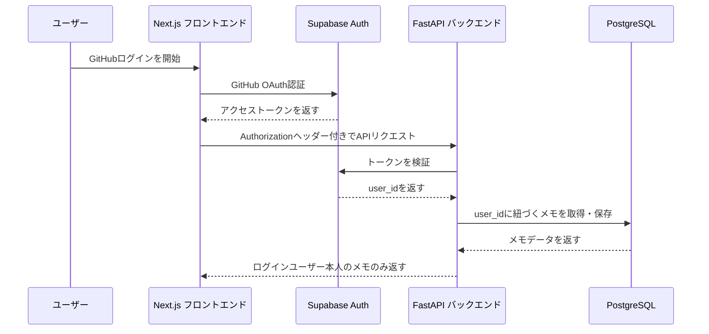
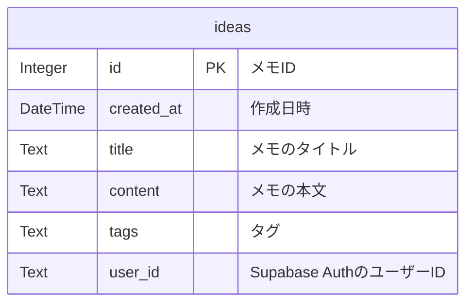

# メモ管理アプリ Backend API

日付・タグ・検索で整理できるメモアプリのバックエンドAPIです。

フロントエンドから送られてきたリクエストを受け取り、Supabase Authでログインユーザーを確認したうえで、PostgreSQLに保存されたメモデータを操作します。

---

## 関連リポジトリ

- フロントエンド: https://github.com/JayMin0227/jay-app-pbl-front
- バックエンド: https://github.com/JayMin0227/jay-app-pbl-back

---

## 使用技術

- Python
- FastAPI
- SQLAlchemy
- PostgreSQL
- Supabase Auth
- python-dotenv
- Uvicorn
- Vercel

---

## 主な機能

- ログインユーザーの認証確認
- メモの一覧取得
- メモの作成
- メモの編集
- メモの削除
- タイトル・本文・タグを対象にしたキーワード検索
- ログインユーザーごとのメモ管理

---

## API一覧

| Method | Endpoint | 内容 | 認証 |
|---|---|---|---|
| GET | `/` | APIの動作確認 | 不要 |
| GET | `/ideas` | ログインユーザー本人のメモ一覧を取得 | 必要 |
| POST | `/ideas` | メモを作成 | 必要 |
| PUT | `/ideas/{idea_id}` | 指定したメモを編集 | 必要 |
| DELETE | `/ideas/{idea_id}` | 指定したメモを削除 | 必要 |
| GET | `/ideas/search?keyword=...` | キーワードでメモを検索 | 必要 |
| GET | `/auth` | 確認用エンドポイント | 不要 |
| GET | `/book` | 確認用エンドポイント | 不要 |

---

## 認証の仕組み

このAPIでは、Supabase Authを使ってログインユーザーを確認しています。

フロントエンドは、ログイン後に取得したアクセストークンを `Authorization` ヘッダーに入れてバックエンドへ送信します。

```text
Authorization: Bearer <access_token>
```

バックエンドは受け取ったトークンをSupabase Authに問い合わせ、正しいトークンであれば `user_id` を取得します。

その `user_id` を使って、ログインユーザー本人のメモだけを取得・作成・編集・削除します。

---

## 認証フロー



---

## ER図



---

## DB設計

### ideas テーブル

| カラム名 | 型 | 内容 |
|---|---|---|
| id | Integer | メモID |
| created_at | DateTime | 作成日時 |
| title | Text | メモのタイトル |
| content | Text | メモの本文 |
| tags | Text | タグ |
| user_id | Text | Supabase AuthのユーザーID |

---

## 環境変数

`.env` ファイルを作成し、以下を設定します。

```env
DATABASE_URL=postgresql://postgres.<project-ref>:<db-password>@<pooler-host>:5432/postgres
SUPABASE_URL=https://<project-ref>.supabase.co
SUPABASE_ANON_KEY=<supabase-anon-public-key>
```

実際のパスワードやAPIキーはGitHubに公開しないように注意してください。

---

## ローカル環境での起動方法

### 1. リポジトリをクローン

```bash
git clone https://github.com/JayMin0227/jay-app-pbl-back.git
cd jay-app-pbl-back
```

### 2. 仮想環境を作成

```bash
python -m venv .venv
```

Git Bashの場合は以下で仮想環境を有効化します。

```bash
source .venv/Scripts/activate
```

PowerShellの場合は以下です。

```powershell
.venv\Scripts\Activate.ps1
```

### 3. 必要なライブラリをインストール

```bash
pip install -r requirements.txt
```

### 4. 環境変数を設定

`.env` ファイルを作成し、以下を設定します。

```env
DATABASE_URL=postgresql://postgres.<project-ref>:<db-password>@<pooler-host>:5432/postgres
SUPABASE_URL=https://<project-ref>.supabase.co
SUPABASE_ANON_KEY=<supabase-anon-public-key>
```

### 5. 開発サーバーを起動

```bash
uvicorn main:app --reload
```

### 6. ブラウザで確認

```text
http://localhost:8000
```

FastAPIの自動生成ドキュメントは以下で確認できます。

```text
http://localhost:8000/docs
```

---

## 工夫した点

### バックエンド側でも認証確認を行うようにした点

フロントエンドでログインしているだけでは、バックエンド側で誰のリクエストなのかを安全に判断できません。

そのため、FastAPI側でSupabase Authにトークンを問い合わせ、取得した `user_id` をもとにメモを操作するようにしました。

### ログインユーザーごとにメモを分離した点

メモデータに `user_id` を持たせることで、ログインユーザー本人のメモだけを取得・作成・編集・削除できるようにしました。

### 検索対象にタイトル・本文・タグを含めた点

メモが増えてもあとから探しやすくするため、タイトルだけでなく、本文やタグも検索対象にしました。

---

## 今後の改善点

- `user_id` を必須項目として扱う
- タグを文字列ではなく専用テーブルで管理する
- APIのテストコードを追加する
- エラーハンドリングを整理する
- CORS設定を本番URLに限定する

---

## 作成者

JayMin0227